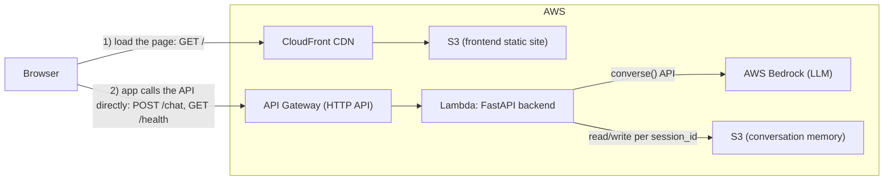

# AI-twin

An AI-powered "digital twin" chat app: a chatbot that answers as you, using your own CV, background notes, and communication style as context for the LLM. The project goes beyond the model call itself — it's provisioned and shipped like a real service: infrastructure defined as code, isolated `dev`/`test`/`prod` environments, and a CI/CD pipeline that deploys on every push to `main`.

## Architecture

```
frontend/   Next.js (React 19, Tailwind) static site, built and synced to S3
backend/    FastAPI app, packaged as an AWS Lambda behind API Gateway
terraform/  Infra as code: Lambda, API Gateway, S3, CloudFront, DynamoDB locks
scripts/    deploy/destroy helpers (bash + PowerShell), used locally and in CI
.github/    GitHub Actions workflows (deploy / destroy)
memory/     stored conversation history (per session_id, gitignored)
```

### How the pieces connect



The browser makes two *separate* connections, not one pipeline — CloudFront never routes to the API:
1. It first loads the static page from CloudFront/S3 (the compiled Next.js site).
2. Once loaded, the page's own JavaScript calls the API Gateway URL directly (`NEXT_PUBLIC_API_URL`, baked into the build) for every chat message — that traffic never passes through CloudFront.

- The **frontend** is a static Next.js export (`npm run build` → `out/`), uploaded to S3 and served through **CloudFront**.
- The **backend** is the same FastAPI app (`backend/server.py`) in two forms: run directly with `uvicorn` for local dev, or wrapped by `lambda_handler.py` and deployed as an AWS **Lambda** function behind an **API Gateway** HTTP API (routes: `GET /`, `GET /health`, `POST /chat`).
- The backend calls **Bedrock** for the LLM response and reads/writes conversation history to an **S3 bucket** (or local disk when running outside AWS), keyed by `session_id`.
- **Terraform** owns all of this infra (S3 buckets, Lambda, API Gateway, CloudFront, optional Route53/ACM for a custom domain) and keeps per-environment state in a remote S3 backend with DynamoDB locking, using Terraform **workspaces** (`dev` / `test` / `prod`) so environments never collide.

## CI/CD

A GitHub Actions pipeline (`.github/workflows/`) drives every deploy, calling the exact same `scripts/deploy.sh` / `destroy.sh` used locally — there's one deployment path, not a separate "CI version" of the logic:

| Workflow | Trigger | What it does |
|---|---|---|
| `deploy.yml` | Push to `main`, or manual `workflow_dispatch` (choose `dev`/`test`/`prod`) | Assumes a short-lived AWS role via OIDC (no AWS keys stored in GitHub), builds the Lambda package, runs `terraform apply` for the selected workspace, builds the frontend with the freshly-created API URL baked in, syncs it to S3, and invalidates the CloudFront cache. |
| `destroy.yml` | Manual `workflow_dispatch` only, requires typing the environment name to confirm | Tears down a given environment via `terraform destroy`, gated by an explicit confirmation input so a stray click can't take down `prod`. |

A few things this buys, beyond "it deploys automatically":
- `dev`, `test`, and `prod` are fully separate Terraform workspaces with their own state and locks, so testing a change can't accidentally touch production.
- Every environment is reproducible from the Terraform files — no infra was clicked together by hand, so it can be recreated, diffed, or torn down on demand.
- Credentials are short-lived and scoped to this repo via OIDC, rather than a long-lived AWS access key sitting in GitHub secrets.

## Running locally

### Backend

```bash
cd backend
cp ../.env.example .env   # fill in AWS_ACCOUNT_ID, DEFAULT_AWS_REGION, etc.
uv sync                   # or: pip install -r requirements.txt
uv run server.py          # serves on http://localhost:8000
```

Requires AWS credentials with Bedrock access configured locally (e.g. via `aws configure`).

### Frontend

```bash
cd frontend
npm install
npm run dev                # http://localhost:3000, talks to http://localhost:8000
```

## Deploying to AWS

Deployment can be run the same way locally or in CI — `scripts/deploy.sh` is the single source of truth:

```bash
./scripts/deploy.sh <environment> <project_name>   # e.g. ./scripts/deploy.sh dev twin
```

This builds the Lambda package, selects/creates the Terraform workspace for `<environment>`, applies the infra, builds the frontend with the resulting API URL, and syncs it to S3/CloudFront. PowerShell equivalents (`deploy.ps1`, `destroy.ps1`) are provided for Windows.

In CI, the same script runs inside `deploy.yml` on every push to `main`, or on demand via the Actions tab (choosing the target environment).

To tear down an environment:

```bash
./scripts/destroy.sh <environment> <project_name>
```

or trigger `destroy.yml` from the Actions tab (requires typing the environment name to confirm).

## Environment variables

See `.env.example` for the minimal set (`AWS_ACCOUNT_ID`, `DEFAULT_AWS_REGION`, `PROJECT_NAME`). The backend additionally supports `CORS_ORIGINS`, `BEDROCK_MODEL_ID`, `USE_S3`, `S3_BUCKET`, and `MEMORY_DIR`. In CI, `AWS_ROLE_ARN`, `AWS_ACCOUNT_ID`, and `DEFAULT_AWS_REGION` are stored as GitHub Actions secrets per environment.
